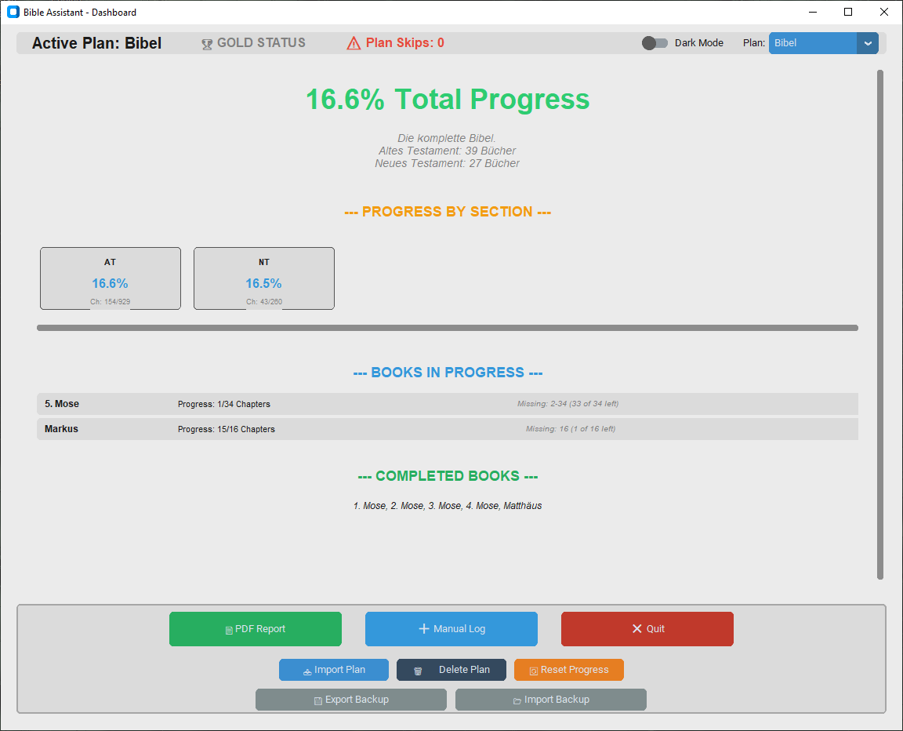
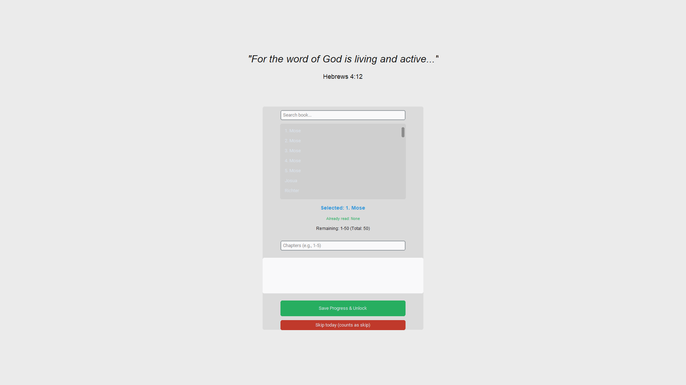
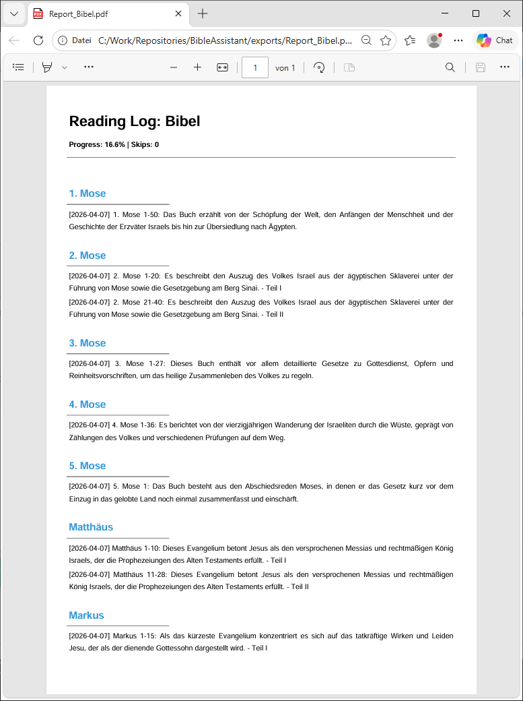
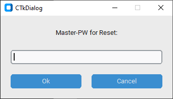
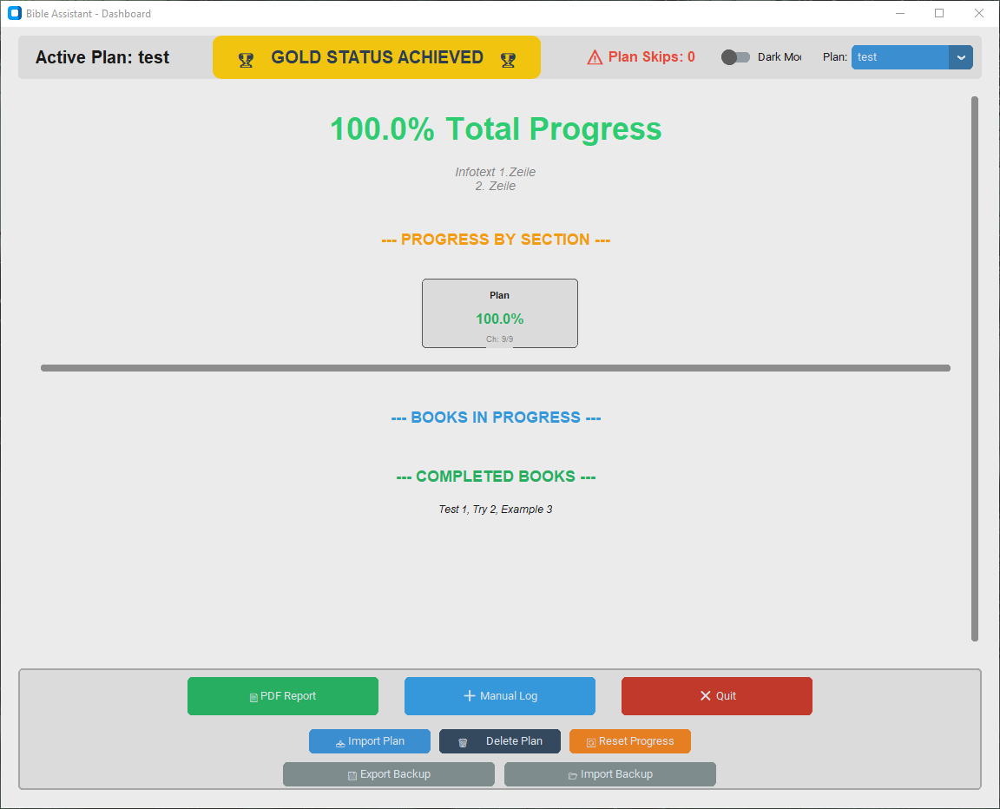
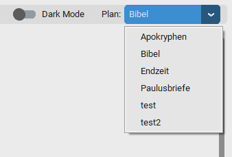
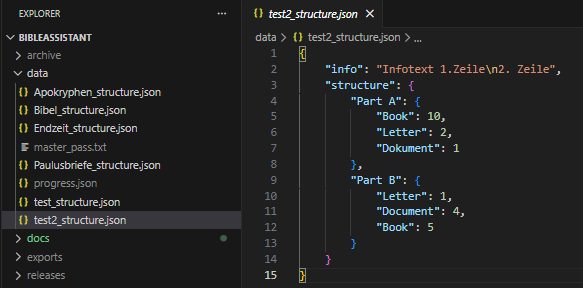

# Bible Assistant

An intelligent companion for reading discipline and progress documentation.

Bible Assistant is a functional proof-of-concept (PoC) designed to explore how software can actively support the formation of consistent reading habits. It combines psychological incentives (desktop lock-screen) with data evaluation (PDF reporting).

---

## Core Features

### Intelligent Desktop Gatekeeper (Discipline Mode)
Bible Assistant acts as a purposeful entry point to your digital workday.
* **Lock-screen Principle:** Upon system startup, a full-screen reminder displays a scripture verse and your current reading goal.
* **Focus Protection:** Access to the desktop is only granted after confirming the daily reading or making a conscious decision to skip.
* **Smart Search:** High-speed book entry using fault-tolerant filtering logic (ignores case, dots, and special characters).

### Multi-Language Support (v1.5)
* **Native Localization:** Full support for German, English, and Norwegian.
* **Dynamic Switching:** Change the interface language on the fly via the Dashboard dropdown menu.
* **Centralized Dictionary:** Easy to extend with additional languages through the internal translation engine.

### Professional Reporting & Documentation
Data is valuable, but presentation makes it meaningful.
* **PDF Export Engine:** Generates print-ready reports covering your entire reading progress.
* **Biblical Sorting:** Regardless of the chronological reading date, entries are logically sorted from Genesis to Revelation.
* **Encoding Fixes:** Robust support for special characters and dashes in the generated reports.

### Flexible Multi-Plan Management
The system adapts to the user's individual needs:
* **Plan Variety:** Switch between canonical, chronological, or custom reading plans.
* **Custom Structures:** Easy integration of personalized reading paths via standardized JSON files.
* **Gold Status:** Visual reward system when reaching 100% completion of a plan.

### Security & Data Integrity
* **Master Password:** Administrative actions (resetting data, deleting progress, or importing new plans) are protected by an auto-generated master password.
* **Centralized Settings:** All preferences (Theme, Language, Active Plan) are stored securely within progress.json.

---

### Other
- Display if the Reading-Plan is completed:

- Choose other/custom Reading-Plans:

- Create your own Reading-Plans:

---

## Project Structure
* **main.py:** Central dashboard and UI controller.
* **src/database.py:** Core logic, statistics, and data processing engine.
* **assets/:** Directory for branding (e.g., icon.ico).
* **data/:** Secure storage for progress (includes settings), plan structures, and passwords.
* **exports/:** Destination folder for generated PDF reports and system backups.

---

## Installation & Setup
1. **Install dependencies:** Run `pip install customtkinter fpdf` in your terminal.
2. **Prepare Assets:** Place your `icon.ico` file into the `assets/` folder.
3. **Run the application:** Execute `python main.py`.
4. **First Run:** Your unique master password will be automatically generated in `data/master_pass.txt`.

---

## System Requirements
* **Python 3.x**
* **Operating System:** Windows (tested), Linux/macOS (compatible)

---

## Version History
### v1.5 (Current Release)
* **Internationalization:** Added Dropdown for language selection (DE, EN, NO).
* **Architecture:** Merged settings.json into progress.json for better data integrity.
* **UI/UX:** Added custom application icon support and improved range formatting.
* **PDF Fix:** Resolved encoding issues with special characters in reports.

### v1.0 - v1.4
* Initial PoC, Lock-screen logic, and basic PDF export.

---

## License
This project is private property. All rights reserved.